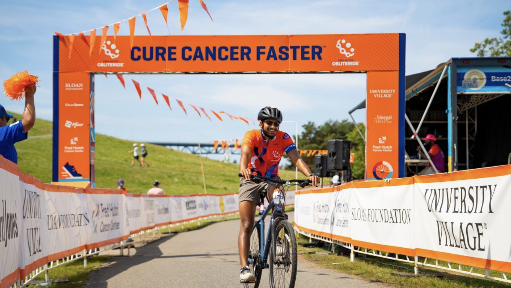

Welcome back to another post from \[VS\]Codes! It’s been an exciting time for me at my new job with Humana, and I’m looking forward to sharing more updates on the projects I’ve been involved in in the near future. In the meantime, I’ve been working on more general health AI content that I hope to be able to share in the coming weeks. Today, however, I'd like to take a brief detour to talk about something that's become an annual tradition for me.

This August, I'll be participating in Fred Hutch Obliteride 2026, cycling 50 miles in support of cancer research at Fred Hutch Cancer Center. This will be my third consecutive year participating in Obliteride, and I'm excited to get back on the bike in support of an organization that played an important role in my career and continues to advance world-class biomedical research.

**You can support my Obliteride fundraiser here:** <https://secure.fredhutch.org/goto/vsriram24>

## Progress at Fred Hutch

Throughout my career, I've seen firsthand how advances in AI, large-scale clinical data, and computational methods are transforming our understanding of disease and helping researchers make discoveries that would have been impossible just a few years ago.

Fred Hutch is home to many of the scientists, clinicians, engineers, and data professionals driving that progress. Their work spans everything from fundamental biological discovery to translational research and clinical care, all with the shared goal of improving the lives of patients.

I'm especially grateful to my former colleagues in the Office of the Chief Data Officer and the Data Science Lab, whose efforts continue to expand access to high-quality data, build modern research infrastructure, and develop AI-enabled tools that empower scientists across the institution.

## Why Public Support Matters

Scientific breakthroughs don't happen in isolation. They require talented researchers, long-term investment, and the freedom to pursue innovative ideas.

Today, academic medical centers face increasing financial challenges as research costs rise and funding becomes more constrained. Philanthropic support gives researchers the flexibility to explore unconventional approaches, adopt emerging technologies, and accelerate discoveries that may ultimately change the standard of care for patients around the world.

That's exactly why events like Obliteride matter. Every mile ridden and every dollar donated helps support the research taking place at Fred Hutch, bringing us another step closer to better diagnostics and more effective treatments.

## Support My Ride

If you'd like to support my ride this year, I'd be incredibly grateful. Every contribution helps advance the lifesaving research happening at Fred Hutch.

**You can support my Obliteride fundraiser here:** <https://secure.fredhutch.org/goto/vsriram24>

Thank you to everyone who has supported me over the past three years, whether through donations, encouragement, or simply helping spread the word. I can't wait to get back on the course and ride for a cause that continues to inspire me.
